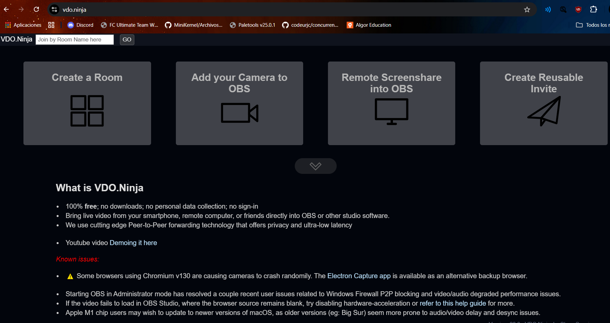

VDO.ninja

 

Para los cafés con invitados por videollamada vamos a usar el recurso de obs que se llama vdo.ninja:
es una tecnología que permite una comunicación segura en tiempo real entre navegadores web.

Todo ocurre dentro del navegador (peer to peer), por lo que tiene latencia bastante baja, buena calidad de video, muy versátil y se conecta directamente con OBS mediante una fuente de tipo navegador.

**Breve Tutorial**

Cuando entramos a la página principal nos encontramos con esta pantalla:

Para lo que queremos usar nosotros, nos conviene elegir la opción de Create a Room. Dentro de esta opción tenemos esto:

.png)

Para nuestro caso en particular, ya está creada la sala CafesOfilibre y anclada en la barra de marcadores de Google en la sesión de Neiser en el portátil. 

Cuando queramos empezar de nuevo, escribiremos un nombre y una contraseña (para más seguridad), y seleccionaremos la opción que pone "The director will be preforming as well, appearing in group scenes", para que nosotros también nos unamos a la "llamada". Por último pincharemos en "Enter de room´s "Control Center in the director´s role" para poder controlar todo nosotros.

.png)

Lo que tendremos que compartir con el invitado será el link de la izquierda que está en el recuadro azul que pone INVITE A GUEST. Para tener la imagen y el audio en OBS necesitaremos añadir como fuente de navegador el link de la derecha en el recuadro verde.

El invitado verá esto y seleccionará Join Room with a Camera, después seleccionará el micro y la cámara:

.png)

.png)

Ahora, nosotros como directores veremos esto:

.png)

Y podremos controlar el volumen, silenciar, ensordecer al invitado y muchas cosas más.

Para poder hablar con el invitado y realizar el podcast, nos uniremos como participantes siendo el director, de esta manera (dando al botón que pone enables director´s microphone or video):

.png)

.png)

Ahora que ya tenemos la llamada configurada, necesitamos configurar en OBS cómo se vería y escucharía todo:

.png)

Elegimos el ancho y el alto y seleccionamos la casilla que pone controlar audio vía OBS, para que se escuche el sonido de la llamada, tanto nuestro micrófono como el micrófono del invitado.